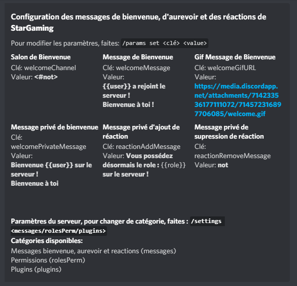

# 3. Message de bienvenue

Vous pouvez configurer le message de bienvenue en faisant `/settings messages`.  
En tapant **/settings \[clé\] \[valeur\]**, vous pouvez également définir, le salon de bienvenue, le message de bienvenue, le gif du message de bienvenue, le message privé de bienvenue, le message privé d'ajout de réaction et de suppression de réaction.

Lorsque vous avez configurés le salon de bienvenue avec **/settings set welcomeChannel \#salon**.  
Vous pouvez également configurer le message de bienvenue avec welcomeMessage.  
  
Dans votre salon bienvenue, vous devriez voir quelque chose comme ça:

Si vous changez également le **welcomePrivateMessage**, les utilisateurs rejoignant le serveur recevront ce message en rejoignant le serveur !

