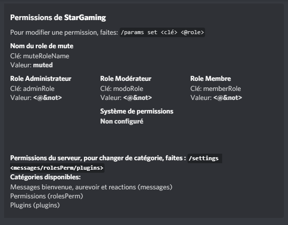
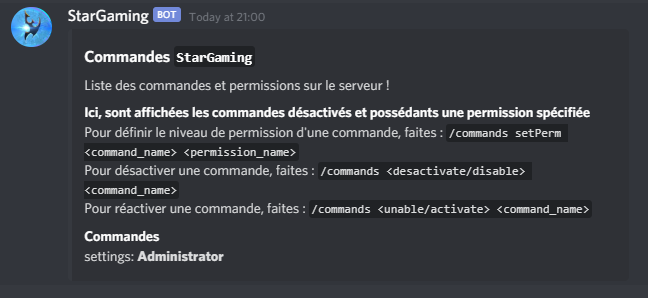

# 4. Permissions

Vous pouvez configurer toutes les permissions via  `/settings rolesPerm`.  
Cette commande vous permet de définir le **nom du rôle de mute**, le **rôle Administrateur**, le **rôle Modérateur** et le **rôle Membre**.  
Tant que vous n'aurez pas configurés les trois rôles, le système de permissions sera désactivé !

Vous pouvez taper `/commands setPerm [nom commande] [Administrator/Moderator/User]`pour définir le niveau de permissions d'une commande. Cette commande vous permet également d'activer ou d'en désactiver une.

